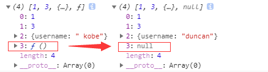

<!--more-->

## 浅拷贝的实现方式

### 1.直接赋值一个变量
```
  let obj = {username: 'kobe', age: 39, sex: {option1: '男', option2: '女'}};
  let obj1 = obj;
  obj1.sex.option1 = '不男不女'; // 修改复制的对象会影响原对象
  console.log(obj1, obj);
```
### 2.Object.assign()

```
let obj = {
    username: 'kobe'
    };
let obj2 = Object.assign(obj);
obj2.username = 'wade';
console.log(obj);//{username: "wade"}
```

### 3.Array.prototype.concat()

```
let arr = [1, 3, {
    username: 'kobe'
    }];
let arr2=arr.concat();    
arr2[2].username = 'wade';
console.log(arr);
```

### 4.Array.prototype.slice()

```
let arr = [1, 3, {
    username: ' kobe'
    }];
let arr3 = arr.slice();
arr3[2].username = 'wade'
console.log(arr);
```

> Array的slice和concat方法不修改原数组，只会返回一个浅复制了原数组中的元素的一个新数组。

## 深拷贝的实现方式

### 1.JSON.parse(JSON.stringify())

```
let arr = [1, 3, {
    username: ' kobe'
}];
let arr4 = JSON.parse(JSON.stringify(arr));
arr4[2].username = 'duncan'; 
console.log(arr, arr4)
```
> 这种方法虽然可以实现数组或对象深拷贝,但不能处理函数

```
let arr = [1, 3, {
    username: ' kobe'
},function(){}];
let arr4 = JSON.parse(JSON.stringify(arr));
arr4[2].username = 'duncan'; 
console.log(arr, arr4)

```



> 这是因为JSON.stringify() 方法是将一个JavaScript值(对象或者数组)转换为一个 JSON字符串，不能接受函数

### 手写递归方法

> 遍历对象、数组直到里边都是基本数据类型，然后再去复制，就是深度拷贝

```
 //定义检测数据类型的功能函数
    function checkedType(target) {
      return Object.prototype.toString.call(target).slice(8, -1)
    }
    //实现深度克隆---对象/数组
    function clone(target) {
      //判断拷贝的数据类型
      //初始化变量result 成为最终克隆的数据
      let result, targetType = checkedType(target)
      if (targetType === 'object') {
        result = {}
      } else if (targetType === 'Array') {
        result = []
      } else {
        return target
      }
      //遍历目标数据
      for (let i in target) {
        //获取遍历数据结构的每一项值。
        let value = target[i]
        //判断目标结构里的每一值是否存在对象/数组
        if (checkedType(value) === 'Object' ||
          checkedType(value) === 'Array') { //对象/数组里嵌套了对象/数组
          //继续遍历获取到value值
          result[i] = clone(value)
        } else { //获取到value值是基本的数据类型或者是函数。
          result[i] = value;
        }
      }
      return result
    }
```

### 函数库lodash
> 该函数库也有提供_.cloneDeep用来做 Deep Copy

```
var _ = require('lodash');
var obj1 = {
    a: 1,
    b: { f: { g: 1 } },
    c: [1, 2, 3]
};
var obj2 = _.cloneDeep(obj1);
console.log(obj1.b.f === obj2.b.f);
// false
```

### 参考文章

[浅拷贝与深拷贝](https://juejin.im/post/5b5dcf8351882519790c9a2e)
