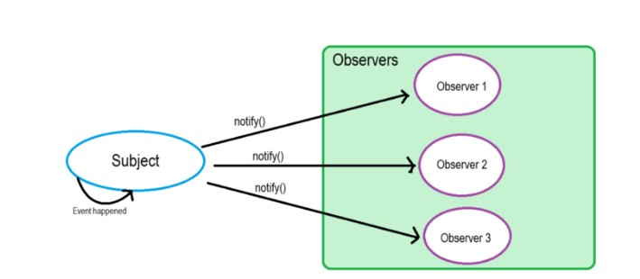

::: tip
今天主要总结下观察者模式（Observer pattern）和发布订阅模式（Pub-Sub  Pattern）的区别
:::

## Observer Pattern

观察者模式定义了对象之间的一对多依赖，这样一来，当一个对象改变状态时，它的所有依赖者都会收到通知并自动更新。而观察者模式属于行为型模式，行为型模式关注的是对象之间的通讯，观察者模式就是观察者和被观察者之间的通讯。

观察者模式有一个别名叫“订阅—发布模式”。报纸大家都订过吧，当你订阅了一份报纸，每天都会有一份最新的报纸送到你手上，有多少人订阅报纸，报社就会发多少份报纸，这是典型的订阅—发布模式，报社和订报纸的客户就是上面文章开头所说的“一对多”的依赖关系。


左侧是Observer，就是观察者，它有一个update方法，当观察者需要被触发的时候执行update。
右侧是主题，主题可以绑定多个观察者，放在observers里面。
主题可以获取状态（getState()),也可以设置状态（setState())
当状态设置完成后，他会触发所有的观察者（notifyAllObservers()),
触发所有观察者里面的update方法。
观察者定义好以后，它就等待被更新，等待被触发，当然，前提是它已经定义好了。
注意一对多，主题是一个，但是观察者可能是多个。

```js
// 主题，接收状态变化，触发每个观察者
class Subject {
  constructor() {
      this.state = 0
      this.observers = []
  }
  getState() {
      return this.state
  }
  setState(state) {
      this.state = state
      this.notifyAllObservers()
  }
  attach(observer) {
      this.observers.push(observer)
  }
  notifyAllObservers() {
      this.observers.forEach(observer => {
          observer.update()
      })
  }
}

// 观察者，等待被触发
class Observer {
  constructor(name, subject) {
      this.name = name
      this.subject = subject
      this.subject.attach(this)
  }
  update() {
      console.log(`${this.name} update, state: ${this.subject.getState()}`)
  }
}

// 测试代码
let s = new Subject()
let o1 = new Observer('o1', s)
let o2 = new Observer('o2', s)
let o3 = new Observer('o3', s)

s.setState(1)
s.setState(2)
s.setState(3)

```


所谓观察者模式，其实就是为了实现**松耦合(loosely coupled)**。

用《Head First设计模式》里的气象站为例子，每当气象测量数据有更新，changed()方法就会被调用，于是我们可以在changed()方法里面，更新气象仪器上的数据，比如温度、气压等等。

但是这样写有个问题，就是如果以后我们想在changed()方法被调用时，更新更多的信息，比如说湿度，那就要去修改changed()方法的代码，这就是紧耦合的坏处。

怎么解决呢？使用观察者模式，面向接口编程，实现松耦合。

观察者模式里面，changed()方法所在的实例对象，就是被观察者（Subject，或者叫Observable），它只需维护一套观察者（Observer）的集合，这些Observer实现相同的接口，Subject只需要知道，通知Observer时，需要调用哪个统一方法就好了：





## Pub-Sub  Pattern

大概很多人都和我一样，觉得发布订阅模式里的Publisher，就是观察者模式里的Subject，而Subscriber，就是Observer。Publisher变化时，就主动去通知Subscriber。

其实并不是。

在发布订阅模式里，发布者，并不会直接通知订阅者，换句话说，发布者和订阅者，彼此互不相识。

互不相识？那他们之间如何交流？

答案是，通过第三者，也就是在消息队列里面，我们常说的经纪人Broker。


```

class Event{
    constructor(){
        this.callbacks = {}
    }
    $off(name){
        this.callbacks[name] = null
    }
    $emit(name, args){
        let cbs = this.callbacks[name]
        if (cbs) {
            cbs.forEach(c=>{
                c.call(this, args)
            })
          }
    }
    $on(name, fn){
        (this.callbacks[name] || (this.callbacks[name] = [])).push(fn)
    }
}
let event = new Event()
event.$on('event1', function(arg){
    console.log('事件1',arg)
})
event.$on('event1', function(arg){
    console.log('又一个事件1',arg)
})
event.$on('event2', function(arg){
    console.log('事件2',arg)
})

event.$emit('event1',{name:'JAY'})
event.$emit('event2',{name:'JJ'})

event.$off('event1')
event.$emit('event1',{name:'JOHN'})

```


发布者只需告诉Broker，我要发的消息，topic是event1；

订阅者只需告诉Broker，我要订阅topic是event1的消息；

于是，当Broker收到发布者发过来消息，并且topic是event1时，就会把消息推送给订阅了topic是event1的订阅者。当然也有可能是订阅者自己过来拉取，看具体实现。

也就是说，发布订阅模式里，发布者和订阅者，不是松耦合，而是完全解耦的。


## 对比

放一张极简的图，给大家对比一下这两个模式的区别：


> 从表面上看：

  * 观察者模式里，只有两个角色 —— 观察者 + 被观察者
  * 而发布订阅模式里，却不仅仅只有发布者和订阅者两个角色，还有一个经常被我们忽略的 —— 经纪人Broker

> 往更深层次讲：

  * 观察者和被观察者，是松耦合的关系
  * 发布者和订阅者，则完全不存在耦合

> 从使用层面上讲：

  * 观察者模式，多用于单个应用内部
  * 发布订阅模式，则更多的是一种跨应用的模式(cross-application pattern)，比如我们常用的消息中间件


