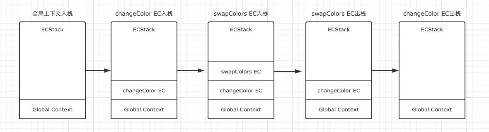
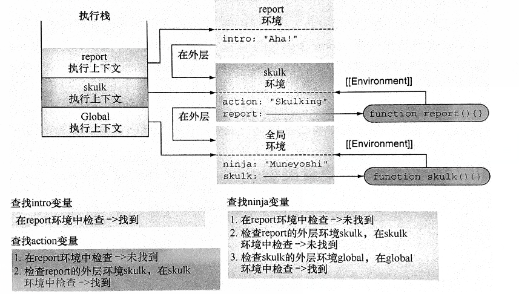

## 执行上下文（Execution Context）

### 什么是执行上下文



每次当控制器转到可执行代码的时候，就会进入一个执行上下文。执行上下文可以理解为当前代码的执行环境，它会形成一个作用域。

执行上下文（Execution Contexts） 是 ECMAScript 代码 运行时（runtime） 的上下文环境。

<!--more-->

在同一时间内，每次只能有一个 执行上下文（Execution Contexts） 运行。这称为 运行执行上下文（running execution context）。


> 执行上下文就是当前 JavaScript 代码被解析和执行时所在环境的抽象概念， JavaScript 中运行任何的代码都是在执行上下文中运行


### 执行上下文的类型
JavaScript中的运行环境大概包括三种情况。
* 全局环境：JavaScript代码运行起来会首先进入该环境
* 函数环境：当函数被调用执行时，会进入当前函数中执行代码
* eval（不建议使用，可忽略）

### 执行上下文的生命周期

执行上下文的生命周期包括三个阶段：创建阶段 → 执行阶段 → 回收阶段

  #### 创建阶段 （es3版）
当函数被调用，但未执行任何其内部代码之前，会做以下三件事：

1. 创建变量对象：首先初始化函数的参数 arguments，提升函数声明和变量声明。
2. 创建作用域链（Scope Chain）：在执行期上下文的创建阶段，作用域链是在变量对象之后创建的。作用域链本身包含变量对象。作用域链用于解析变量。当被要求解析变量时，JavaScript 始终从代码嵌套的最内层开始，如果最内层没有找到变量，就会跳转到上一层父作用域中查找，直到找到该变量。
3. 确定 this 指向：包括多种情况，下文会详细说明
   
在一段 JS 脚本执行之前，要先解析代码（所以说 JS 是解释执行的脚本语言），解析的时候会先创建一个全局执行上下文环境，先把代码中即将执行的变量、函数声明都拿出来。变量先暂时赋值为 undefined，函数则先声明好可使用。这一步做完了，然后再开始正式执行程序。

另外，一个函数在执行之前，也会创建一个函数执行上下文环境，跟全局上下文差不多，不过 函数执行上下文中会多出 this arguments 和函数的参数。


全局代码的上下文环境数据内容为：

|                     数据                     |             值              |
| :------------------------------------------: | :-------------------------: |
| 普通变量（包括函数表达式），如： var a = 10; | 声明（默认赋值为undefined） |
|       函数声明，如： function fn() { }       |            赋值             |
|                     this                     |            赋值             |

如果代码段是函数体，那么在此基础上需要附加：

|         数据         |  值   |
| :------------------: | :---: |
|         参数         | 赋值  |
|      arguments       | 赋值  |
| 自由变量的取值作用域 | 赋值  |


> Q:自由变量是什么 ?

在A作用域中使用的变量x，却没有在A作用域中声明（即在其他作用域中声明的），对于A作用域来说，x就是一个自由变量。


  #### 创建阶段 （es5版）
  
JS执行上下文的创建阶段主要负责三件事：确定this---创建词法环境（LexicalEnvironment）---创建变量环境（VariableEnvironment）

这里我就直接借鉴了他人翻译资料的伪代码，来表示这个创建过程：

```
ExecutionContext = {  
    // 确定this的值
    ThisBinding = <this value>,
    // 创建词法环境
    LexicalEnvironment = {},
    // 创建变量环境
    VariableEnvironment = {},
};
```

   1. 确定this

官方的称呼为This Binding，在全局执行上下文中，this总是指向全局对象，例如浏览器环境下this指向window对象。

而在函数执行上下文中，this的值取决于函数的调用方式，如果被一个对象调用，那么this指向这个对象。否则this一般指向全局对象window或者undefined（严格模式）。

我在之前有专门写一篇介绍this的博文，现在看来写的很不好，之后我会重新理解写一篇通俗易懂的文章。

this文章已更新--2019.12.3： js 五种绑定彻底弄懂this，默认绑定、隐式绑定、显式绑定、new绑定、箭头函数绑定详解

  2. 词法环境

词法环境是一个包含标识符变量映射的结构，这里的标识符表示变量/函数的名称，变量是对实际对象【包括函数类型对象】或原始值的引用。

词法环境由环境记录与对外部环境引入记录两个部分组成。

其中环境记录用于存储变量和函数声明的实际位置，便于代码执行阶段能对应赋值。而外部环境引入记录用于保存它可以访问的其它外部环境，那么说到这个，是不是有点作用域链的意思？

我们在前文提到了全局执行上下文与函数执行上下文，所以这也导致了词法环境分为全局词法环境与函数词法环境两种。

全局词法环境：

对外部环境的引入记录为null，因为它本身就是最外层环境，除此之外它还包含了全局对象的所有属性方法，以及用户自定义的全局对象（通过var声明）。

函数词法环境：

包含了用户在函数中定义的所有变量外，还包含了一个arguments对象。函数词法环境的外部环境引入可以是全局环境，也可以是其它函数环境，这个根据实际代码而来。

这里借用译文中的伪代码（环境记录在全局和函数中也不同，全局中的环境记录叫对象环境记录，函数中环境记录叫声明性环境记录，说多了糊涂，下方有展示）：

```
// 全局环境
GlobalExectionContext = {
    // 全局词法环境
    LexicalEnvironment: {
        // 环境记录
        EnvironmentRecord: {
            Type: "Object", //类型为对象环境记录
            // 标识符绑定在这里 
        },
        outer: < null >
    }
};
// 函数环境
FunctionExectionContext = {
    // 函数词法环境
    LexicalEnvironment: {
        // 环境纪录
        EnvironmentRecord: {
            Type: "Declarative", //类型为声明性环境记录
            // 标识符绑定在这里 
        },
        outer: < Global or outerfunction environment reference >
    }
};
```

3. 变量环境

变量环境可以说也是词法环境，它具备词法环境所有属性，一样有环境记录与外部环境引入。在ES6中唯一的区别在于词法环境用于存储函数声明与let const声明的变量，而变量环境仅仅存储var声明的变量。

我们通过一串伪代码来理解它们：

```
let a = 20;  
const b = 30;  
var c;

function multiply(e, f) {  
 var g = 20;  
 return e * f * g;  
}

c = multiply(20, 30);
```

我们用伪代码来描述上述代码中执行上下文的创建过程：


```
//全局执行上下文
GlobalExectionContext = {
    // this绑定为全局对象
    ThisBinding: <Global Object>,
    // 词法环境
    LexicalEnvironment: {  
        //环境记录
      EnvironmentRecord: {  
        Type: "Object",  // 对象环境记录
        // 标识符绑定在这里 let const创建的变量a b在这
        a: < uninitialized >,  
        b: < uninitialized >,  
        multiply: < func >  
      }
      // 全局环境外部环境引入为null
      outer: <null>  
    },
  
    VariableEnvironment: {  
      EnvironmentRecord: {  
        Type: "Object",  // 对象环境记录
        // 标识符绑定在这里  var创建的c在这
        c: undefined,  
      }
      // 全局环境外部环境引入为null
      outer: <null>  
    }  
  }

  // 函数执行上下文
  FunctionExectionContext = {
     //由于函数是默认调用 this绑定同样是全局对象
    ThisBinding: <Global Object>,
    // 词法环境
    LexicalEnvironment: {  
      EnvironmentRecord: {  
        Type: "Declarative",  // 声明性环境记录
        // 标识符绑定在这里  arguments对象在这
        Arguments: {0: 20, 1: 30, length: 2},  
      },  
      // 外部环境引入记录为</Global>
      outer: <GlobalEnvironment>  
    },
  
    VariableEnvironment: {  
      EnvironmentRecord: {  
        Type: "Declarative",  // 声明性环境记录
        // 标识符绑定在这里  var创建的g在这
        g: undefined  
      },  
      // 外部环境引入记录为</Global>
      outer: <GlobalEnvironment>  
    }  
  }
```
不知道你有没有发现，在执行上下文创建阶段，函数声明与var声明的变量在创建阶段已经被赋予了一个值，var声明被设置为了undefined，函数被设置为了自身函数，而let  const被设置为未初始化。

现在你总知道变量提升与函数提升是怎么回事了吧，以及为什么let const为什么有暂时性死域，这是因为作用域创建阶段JS引擎对两者初始化赋值不同。

上下文除了创建阶段外，还有执行阶段，这点大家应该好理解，代码执行时根据之前的环境记录对应赋值，比如早期var在创建阶段为undefined，如果有值就对应赋值，像let const值为未初始化，如果有值就赋值，无值则赋予undefined。


> Q:  关于变量对象与活动对象

为什么别人的博文介绍上下文都是谈作用域，变量对象和活动对象，我这就成了词法环境，变量环境了。

我在阅读相关资料也产生了这个疑问，一番查阅可以确定的是，变量对象与活动对象的概念是ES3提出的老概念，从ES5开始就用词法环境和变量环境替代了，因为更好解释。

在上文中，我们通过介绍词法环境与变量环境解释了为什么var会存在变量提升，为什么let const没有，而通过变量对象与活动对象是很难解释的，由其是在JavaScript在更新中不断在弥补当初设计的坑。

其次，词法环境的概念与变量对象这类概念也是可以对应上的。

我们知道变量对象与活动对象其实都是变量对象，变量对象是与执行上下文相关的数据作用域，存储了在上下文中定义的变量和函数声明。而在函数上下文中，我们用活动对象(activation object, AO)来表示变量对象。

那这不正好对应到了全局词法记录与函数词法记录了吗。而且由于ES6新增的let  const不存在变量提升，于是正好有了词法环境与变量环境的概念来解释这个问题。

所以说到这，你也不用为词法环境，变量对象的概念闹冲突了。

#### 执行阶段
执行变量赋值、代码执行

#### 回收阶段
执行上下文出栈等待虚拟机回收执行上下文


### 执行上下文栈（Execution Context Stack）

函数多了，就有多个函数执行上下文，每次调用函数创建一个新的执行上下文，那如何管理创建的那么多执行上下文呢？

JavaScript 引擎创建了执行上下文栈来管理执行上下文。可以把执行上下文栈认为是一个存储函数调用的栈结构，遵循先进后出的原则。


从上面的流程图，我们需要记住几个关键点：

* JavaScript 执行在单线程上，所有的代码都是排队执行。
* 一开始浏览器执行全局的代码时，首先创建全局的执行上下文，压入执行栈的顶部。
* 每当进入一个函数的执行就会创建函数的执行上下文，并且把它压入执行栈的顶部。* 当前函数执行完成后，当前函数的执行上下文出栈，并等待垃圾回收。
* 浏览器的 JS 执行引擎总是访问栈顶的执行上下文。
* 全局上下文只有唯一的一个，它在浏览器关闭时出栈。

## 词法环境(Lexical Environment)

词法环境（即作用域）是js引擎内部用来跟踪标识符和特定变量之间的映射关系。

词法环境主要基于代码嵌套，通过代码嵌套可以实现代码结构的包含关系

在作用域范围内，每次执行代码时，代码结构都会获得与之关联的词法环境，而我们知道内部代码结构可以访问外部代码结构中定义的变量，外部代码结构不能访问内部代码结构定义的变量，js引擎就是根据词法环境来进行这些变量的跟踪的。

因为需要能够访问到外部代码结构，所以需要跟踪外部词法变量，如果当前环境中无法找到某一个标识符，就会对外部环境进行查找，一旦找到匹配的变量或者在全局环境中依然没有找到匹配的变量而返回错误，就会停止查找。
```
var ninja = "Muneyoshi"
function skulk(){
    var action = "skulking"
    function report(){
        var intro = "Aha!"
        console.log(intro)
        console.log(action)
        console.log(ninja)
    }
    report()
}
skulk()
```


在这个例子中，图中展示了当函数执行时，各个标识符是如何查找的，执行上下文关联词法环境，词法环境中包含了在上下文中定义的标识符的映射表，例如全局环境中具有ninja和skulk的映射表，skulk环境中具有action和report的映射表，report环境中具有intro的映射表。

在创建函数的时候，都会创建一个与之相关联的词法环境，并存储在名为[[Environment]]的内部属性上，例如skulk函数保存全局环境的引用，report函数保存skulk环境的引用，这些都是函数被创建时所在的环境。


## 总结

1.全局执行上下文一般由浏览器创建，代码执行时就会创建；函数执行上下文只有函数被调用时才会创建，调用多少次函数就会创建多少上下文。

2.调用栈用于存放所有执行上下文，满足FILO规则。

3.执行上下文创建阶段分为绑定this，创建词法环境，变量环境三步，两者区别在于词法环境存放函数声明与const let声明的变量，而变量环境只存储var声明的变量。

4.词法环境主要由环境记录与外部环境引入记录两个部分组成，全局上下文与函数上下文的外部环境引入记录不一样，全局为null，函数为全局环境或者其它函数环境。环境记录也不一样，全局叫对象环境记录，函数叫声明性环境记录。

5.你应该明白了为什么会存在变量提升，函数提升，而let const没有。

6.ES3之前的变量对象与活动对象的概念在ES5之后由词法环境，变量环境来解释，两者概念不冲突，后者理解更为通俗易懂。

## 参考链接
[执行上下文和词法环境](https://www.dazhuanlan.com/2019/12/16/5df6ded8413ab/)<br/> 
[一篇文章看懂JS执行上下文](https://www.cnblogs.com/echolun/p/11438363.html)