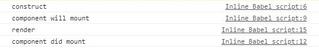
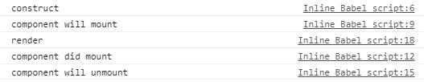

## Life Cycle
```
ReactDOM.render(
    <header/>,
    document.getElementById('root')
)
```
<!--more-->
=>

```
ReactDOM.render(
    React.createElement(Header, null),
    document.getElementById('root')
)
```

=>

```
// React.createElement 中实例化一个 Header
const header = new Header(props, children)
// React.createElement 中调用 header.render 方法渲染组件的内容
const headerJsxObject = header.render()

// ReactDOM 用渲染后的 JavaScript 对象来来构建真正的 DOM 元素
const headerDOM = createDOMFromObject(headerJsxObject)
// ReactDOM 把 DOM 元素塞到页面上
document.getElementById('root').appendChild(headerDOM)
```

> 我们把React.js将组件渲染，并且构造DOM元素然后塞入页面的过程称为组建的挂载

> 所以一个组件的方法调用是这么一个过程

```
constructor()
render()
//然后构造DOM元素插入页面
```

> React.js 为了让我们能够更好的掌握组件的挂载过程，往上面插入了两个方法
```
constructor()
-> componentWillMount()
render()
//然后构造DOM元素插入页面
-> componentDidMount()
```

## 第一个例子

```
    class Header extends  React.Component {
        constructor(){
            super()
            console.log('construct');
        }
        componentWillMount(){
            console.log('component will mount')
        }
        componentDidMount(){
            console.log('component did mount')
        }
        render(){
            console.log('render')
            return (
                <div>
                <h1 className='title'> React LifeCycle </h1> 
                </div>
            )
        }
    }
```
结果如下




## 加一个删除前的钩子

```
  class Header extends React.Component {
        constructor(){
            super()
            console.log('construct');
        }
        componentWillMount(){
            console.log('component will mount')
        }
        componentDidMount(){
            console.log('component did mount')
        }
        componentWillUnmount() {
            console.log('component will unmount')
        }
        render(){
            console.log('render')
            return (
                <div>
                <h1 className='title'> React LifeCycle </h1> 
                </div>
            )
        }
    }

    class Index extends React.Component {
        constructor() {
            super()
            this.state = {
            isShowHeader: true
            }
        }

        handleShowOrHide () {
            this.setState({
            isShowHeader: !this.state.isShowHeader
            })
        }

        render () {
            return (
            <div>
                {this.state.isShowHeader ? <Header /> : null}
                <button onClick={this.handleShowOrHide.bind(this)}>
                显示或者隐藏标题
                </button>
            </div>
            )
        }
    }

```

点击页面上的按钮，控制台打印出来下图的最后一行，说明 componentWillUnmount 确实被 React.js 所调用了




## 这几个钩子的使用

```
class Clock extends React.Component {
  constructor () {
    super()
    this.state = {
      date: new Date()
    }
  }
  componentWillMount () {
    //一些组件启动的动作，包括像 Ajax 数据的拉取操作、一些定时器的启动等，就可以放在 componentWillMount 里面进行
    // ajax.get('http://json-api.com/user', (userData) => {
    //   this.setState({ userData })
    // })
    this.timer = setInterval(() => {
      this.setState({ date: new Date() })
    }, 1000)
  }
  componentWillUnmount () {
    clearInterval(this.timer)
  }
  render () {
    return (
      <div>
        <h1>
          <p>现在的时间是</p>
          {this.state.date.toLocaleTimeString()}
        </h1>
      </div>
    )
  }
}


class Index extends React.Component {
  constructor () {
    super()
    this.state = { isShowClock: true }
  }

  handleShowOrHide () {
    this.setState({
      isShowClock: !this.state.isShowClock
    })
  }

  render () {

    //当时钟隐藏的时候，我们并没有清除定时器。我们给需要 Clock 添加 componentWillUnmount
    return (
      <div>
        {this.state.isShowClock ? <Clock /> : null }
        <button onClick={this.handleShowOrHide.bind(this)}>
          显示或隐藏时钟
        </button>
      </div>
    )
  }
}
```

> 我们一般会把组件的 state 的初始化工作放在 constructor 里面去做；在 componentWillMount 进行组件的启动工作，例如 Ajax 数据拉取、定时器的启动；组件从页面上销毁的时候，有时候需要一些数据的清理，例如定时器的清理，就会放在 componentWillUnmount 里面去做。

>一般来说，有些组件的启动工作是依赖 DOM 的，例如动画的启动，而 componentWillMount 的时候组件还没挂载完成，所以没法进行这些启动工作，这时候就可以把这些操作放在 componentDidMount 当中。

